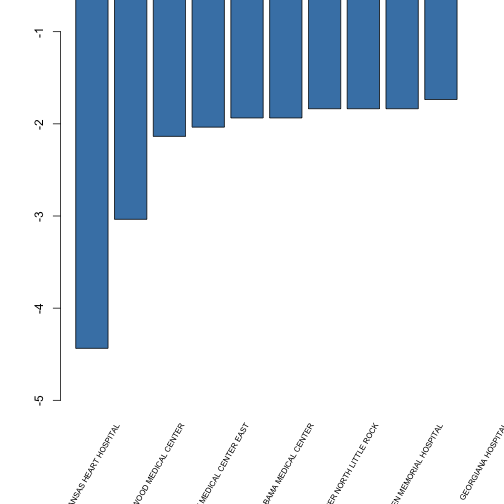

Presentation on US Hospital Comparater
========================================================
author: Li Ying
date: 2015/06/21
transition: rotate

<small> 
Department of Psychology   
The University of Warwick  
</small>


Data Source
========================================================
- This shiny app is named US Hospital Comparater. It is used for direct comparison among all US hospitals in terms of their mortality rate in three domains: heart attack, heart failure, and pneumonia.
   - The data is downloaded from https://d396qusza40orc.cloudfront.net/rprog%2Fdata%2FProgAssignment3-data.zip
   - You find Hospital Compare data on data.medicare.gov. This website allows
you to view the data files embedded on a webpage without downloading
them. The data on data.medicare.gov can usually be viewed the same day
it has been updated on Hospital Compare. Use data.medicare.gov to
customize views and filter the Hospital Compare data.

Variable
====================================

```
 [1] "Provider.Number" "Hospital.Name"   "Address.1"      
 [4] "City"            "State"           "ZIP.Code"       
 [7] "County.Name"     "Phone.Number"    "Heart Attack"   
[10] "Heart Failure"   "Pneumonia"      
```

```

character   numeric 
        8         3 
```

Sample Output: Table (display top5)
========================================================
Input Select:

- State:AL, AR
- Domain:Heart Attack


```
[1] "ARKANSAS HEART HOSPITAL"                        
[2] "CRESTWOOD MEDICAL CENTER"                       
[3] "BAPTIST MEDICAL CENTER EAST"                    
[4] "SOUTHEAST ALABAMA MEDICAL CENTER"               
[5] "BAPTIST HEALTH MEDICAL CENTER NORTH LITTLE ROCK"
```

Sample Output: Figure (display top5)
========================================================

 

Thanks You
===
type: section
